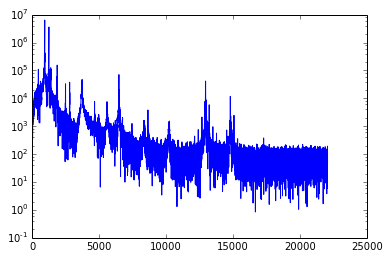

# Sprawozdanie

## Identyfikacja płci

### Opis algorytmu

Podjąłem różne próby rozwiązania problemu stosując m.in. auto-korrelację oraz cepstrum. Problemem była zwracana przez algorytmy częstotliwość. Działały idealnie dla czystych plików, miały jednak poważne problemy z plikami z zadania.

Ostatecznie, najlepiej sprawdziło się najprostsze podejście. Zwrócona częstotliwość to częstotliwość dla maksymalnej amplitudy (wyznaczonej przez FFT) - odrzucając częstotliwości niemożliwe do osiągnięcia przez człowieka (poniżej **80Hz** oraz powyżej **230Hz**).

Przy określeniu płci skorzystałem z charakterystyki częstotliwości krtaniowej.
* **90 - 150 Hz** dla mężczyzn
* **145 - 225 Hz** dla kobiet

Biorąc pod uwagę szumy w plikach jako wartość krytyczną uznałem **170 Hz**. Poniżej tej wartości próbkę określam jako męską, natomiast powyżej jako damską.

### Wyniki

#### Wyniki
```
Male:    37 / 45 (82%)
Female:  39 / 46 (85%)
----------------------
Global:  76 / 91 (84%)
```

#### Szczegółowe wyniki
```
01 : [ F ] True     G:100%    F:100%    M:-
02 : [ M ] True     G:100%    F:100%    M:100%
03 : [ F ] True     G:100%    F:100%    M:100%
04 : [ M ] True     G:100%    F:100%    M:100%
05 : [ M ] True     G:100%    F:100%    M:100%
06 : [ F ] True     G:100%    F:100%    M:100%
07 : [ M ] True     G:100%    F:100%    M:100%
08 : [ F ] True     G:100%    F:100%    M:100%
09 : [ F ] True     G:100%    F:100%    M:100%
10 : [ M ] True     G:100%    F:100%    M:100%
11 : [ M ] True     G:100%    F:100%    M:100%
12 : [ F ] True     G:100%    F:100%    M:100%
13 : [ M ] True     G:100%    F:100%    M:100%
14 : [ F ] True     G:100%    F:100%    M:100%
15 : [ F ] False    G:93%     F:88%     M:100%
16 : [ F ] True     G:94%     F:89%     M:100%
17 : [ M ] True     G:94%     F:89%     M:100%
18 : [ F ] True     G:94%     F:90%     M:100%
19 : [ M ] True     G:95%     F:90%     M:100%
20 : [ M ] True     G:95%     F:90%     M:100%
21 : [ M ] False    G:90%     F:90%     M:91%
22 : [ F ] False    G:86%     F:82%     M:91%
23 : [ M ] True     G:87%     F:82%     M:92%
24 : [ M ] True     G:88%     F:82%     M:92%
25 : [ F ] True     G:88%     F:83%     M:92%
26 : [ M ] False    G:85%     F:83%     M:86%
27 : [ M ] True     G:85%     F:83%     M:87%
28 : [ F ] True     G:86%     F:85%     M:87%
29 : [ F ] True     G:86%     F:86%     M:87%
30 : [ M ] True     G:87%     F:86%     M:88%
31 : [ F ] True     G:87%     F:87%     M:88%
32 : [ M ] True     G:88%     F:87%     M:88%
33 : [ M ] True     G:88%     F:87%     M:89%
34 : [ F ] True     G:88%     F:88%     M:89%
35 : [ M ] True     G:89%     F:88%     M:89%
36 : [ F ] True     G:89%     F:88%     M:89%
37 : [ F ] True     G:89%     F:89%     M:89%
38 : [ M ] True     G:89%     F:89%     M:90%
39 : [ M ] True     G:90%     F:89%     M:90%
40 : [ F ] False    G:88%     F:84%     M:90%
41 : [ F ] False    G:85%     F:80%     M:90%
42 : [ M ] True     G:86%     F:80%     M:91%
43 : [ M ] True     G:86%     F:80%     M:91%
44 : [ F ] False    G:84%     F:76%     M:91%
45 : [ M ] False    G:82%     F:76%     M:88%
46 : [ F ] True     G:83%     F:77%     M:88%
47 : [ F ] True     G:83%     F:78%     M:88%
48 : [ F ] True     G:83%     F:79%     M:88%
49 : [ M ] True     G:84%     F:79%     M:88%
50 : [ F ] True     G:84%     F:80%     M:88%
51 : [ F ] False    G:82%     F:77%     M:88%
52 : [ M ] True     G:83%     F:77%     M:88%
53 : [ M ] False    G:81%     F:77%     M:85%
54 : [ F ] True     G:81%     F:78%     M:85%
55 : [ F ] True     G:82%     F:79%     M:85%
56 : [ M ] True     G:82%     F:79%     M:86%
57 : [ F ] True     G:82%     F:79%     M:86%
58 : [ M ] False    G:81%     F:79%     M:83%
59 : [ F ] True     G:81%     F:80%     M:83%
60 : [ F ] True     G:82%     F:81%     M:83%
61 : [ M ] True     G:82%     F:81%     M:83%
62 : [ F ] True     G:82%     F:81%     M:83%
63 : [ M ] True     G:83%     F:81%     M:84%
64 : [ M ] True     G:83%     F:81%     M:84%
65 : [ M ] True     G:83%     F:81%     M:85%
66 : [ F ] True     G:83%     F:82%     M:85%
67 : [ F ] False    G:82%     F:79%     M:85%
68 : [ F ] True     G:82%     F:80%     M:85%
69 : [ F ] True     G:83%     F:81%     M:85%
70 : [ M ] True     G:83%     F:81%     M:85%
71 : [ M ] True     G:83%     F:81%     M:86%
72 : [ F ] True     G:83%     F:81%     M:86%
73 : [ F ] True     G:84%     F:82%     M:86%
74 : [ F ] True     G:84%     F:82%     M:86%
75 : [ M ] False    G:83%     F:82%     M:83%
76 : [ M ] False    G:82%     F:82%     M:81%
77 : [ F ] True     G:82%     F:82%     M:81%
78 : [ M ] True     G:82%     F:82%     M:82%
79 : [ F ] True     G:82%     F:83%     M:82%
80 : [ M ] True     G:82%     F:83%     M:82%
81 : [ F ] True     G:83%     F:83%     M:82%
82 : [ M ] True     G:83%     F:83%     M:82%
83 : [ F ] True     G:83%     F:84%     M:82%
84 : [ M ] False    G:82%     F:84%     M:80%
85 : [ F ] True     G:82%     F:84%     M:80%
86 : [ F ] True     G:83%     F:84%     M:80%
87 : [ M ] True     G:83%     F:84%     M:81%
88 : [ F ] True     G:83%     F:85%     M:81%
89 : [ M ] True     G:83%     F:85%     M:81%
90 : [ M ] True     G:83%     F:85%     M:82%
91 : [ M ] True     G:84%     F:85%     M:82%
```

## Sygnały I

**1. Punkty na osi OX spektrum są teraz kolejnymi liczbami naturalnymi, a nie częstotliwościami w Hz. Popraw skrypt, tak aby oś OX spektrum była w Hz (podpowiedź: oś OX rozpoczyna się od 0Hz, a kończy się na (prawie!)  Hz, gdzie  jest częstotliwością próbkowania).**
```python
freqs = linspace(0, w, n, endpoint = False)
```
**2. Wygeneruj spektrum dla funkcji sinus o częstotliwościach 5Hz i 21Hz. Czy rozpoznajesz te funkcje patrząc na ich spróbkowane wykresy?**

Dla **5Hz** wykres jest widoczny, natomiast dla **21Hz** jest niemożliwy do rozpoznania.

**3. Porównaj spektrum funkcji sin(2*pi*t), 2*sin(2*pi*t) i 3*sin(2*pi*t). Jak zmienia się wartość na osi OY na wykresie spektrum?**<br/>
Wartości pozostają niezmienione

**4. Ile punktów jest na wykresach przy częstotliwości próbkowania 50Hz, T=1s? Zwiększ dwukrotnie liczbę próbek poprzez zwiększenie rozważanego przedziału czasowego. Następnie: dla sin(2*pi*t) porównaj wartość na osi OY spektrum uzyskane w tym oraz poprzednim punkcie.**<br/>
Liczba punktów jest wprost proporcjonalna do liczby próbek.

**5. Na podstawie wyników uzyskanych w dwóch poprzednich punktach przeskaluj oś OY spektrum tak, aby wskazywała wartości amplitud badanych sygnałów. Sprawdź wyniki dla kilku wybranych funkcji, częstotliwości próbkowania oraz rozważanych liczb punktów.**
```python
ylim((0,max(signal1)))
```
**6. Jak się nazywa twierdzenie, którego konsekwencją jest takie zachowanie się spektrum?**
Nyquista-Shannona o próbkowaniu

**7. sin(5*pi*t), T=1s, w=100Hz. Co trzeba zmienić, aby precyzyjnie określić częstotliwość tej funkcji na podstawie spektrum?**<br/>
Należy zmienić częstotliwość próbkowania.

**8. sin(4*2*pi*t) + 0.5*random.random(n), T=2s, w=40Hz. Czy rozpoznajesz zadaną funkcję w szumie? Zwiększaj stopniowo początkowy poziom szumu (0.5) aż spektrum nie będzie jednoznaczne.**<br/>
Przy współczynniku <code>4.75</code> funkcja jest trudna do rozpoznania.

**9. 2.3 + sin(2*pi*t), T=1s, w=100Hz. Czy amplituda zerowego prążka jest prawidłowa? Dlaczego?**<br/>
Amplituda nie jest prawidłowa, spectrum nie jest symetrycze.

**10. sin(2*pi*t) oraz sin(2*pi*t + pi/4) dla T=1s, w=20Hz. Czy informacja o fazie zniknęła? Poszukaj śladów tej informacji w tablicy, będącej wynikiem operacji fft(signal).**
Informacja o fazie zniknęła.

## Sygnały II

#### 1. Słońce


```
Częstotliwość  cyklu aktywności słonecznej wynosi 1 na ok 12 lat.
```

#### 2. Proste filtrowanie.


#### 3. Informacje o fazie.


#### 4. Spectrum.



